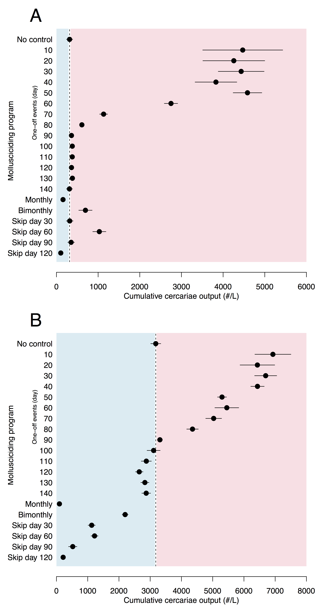

******  
   

## _Schistosome_ Infection Dynamic Energy Budget (SIDEB) model     

### Snapshot

text

### Location

Emory University Atlanta, USA

### People

**Matt Malishev, Emory University, USA**  
David Civitello, Emory University, USA    

### Tasks

* Integrate lab data on host-parasite infection in the _Biomphalara glabrata_ and _Schistosoma mansoni_ system to build a population transmission model to forecast human exposure risk.  
* Simulate the consequences of applying chemical control strategies (molluscicides) that vary in frequency and intensity for mediating human-infectious parasite output throughout the transmission season.    

### Outcomes

* **Malishev M** & Civitello DJ (2019) Linking bioenergetics and parasite transmission models suggests mismatch between snail host density and production of human schistosomes. Integrat. and Comparative Biology, iz385, [https://doi.org/10.1093/icb/icz058](https://academic.oup.com/icb/advance-article-abstract/doi/10.1093/icb/icz058/5497795?redirectedFrom=fulltext).    

* **Malishev M** & Civitello DJ. Modelling how resource competition among snail hosts affects the mollusciciding frequency and intensity needed to control human schistosomes. _In review_.    

### Example outputs  

 
###### Figure 1. Cumulative human-infectious cercariae output (# 500 L–1 ± SE) for A) logistically growing periphyton algae and B) constant detritus subsidy after the seven simulated molluscicide programs (n = 5) for schistosomiasis control at 95% host mortality (hb = 3.0 d–1) showing potential program success (left of dashed line, in blue) and failure (right of dashed line, in red): no control, one-off control every tenth day (day 10–140), monthly, bimonthly (every two months), skipping day 30, skipping day 60, skipping day 90, and skipping day 120. Resource growth rates are r = 0.25 d-1 and det = 0.25 mg C d-1 for algae and detritus, respectively.   

 

###### Figure 2. Human-infectious cercariae output (# 500 L–1) for A) logistically growing periphyton algae and B) constant detritus subsidy over the 150-day transmission season for no control, 50%, 75%, 90%, 95%, and 99% host mortality (implemented as an event-based change in the baseline mortality hazard rate, hb = 0.69, 1.39, 2.3, 3.0, and 4.6 d–1, respectively) after control on day 30 only, bimonthly (every two months, day 60 and day 120), and monthly (WHO recommendation). Lighter color areas represent higher cercariae densities. Early mollusciciding (day 30 only) results in severe rebounds late season unless snail host mortality is 99%. Compared to scenarios with algae, detritus scenarios with no control produces extended cercariae outputs and thus shows prolonged, exaggerated rebounds late in the season after a ‘risky’ molluscicide event (< 99% intensity and for early and intense mollusciciding, i.e. day 30 only). Similarly, bimonthly generates bimodal peaks from prolonged cercariae output. Resource growth rates are r = 0.25 d-1 and det = 0.25 mg C d-1 for algae and detritus, respectively.     

   
 

------------------------------------------------------------------------

[Back to top](#top) | [Home](./index.md)