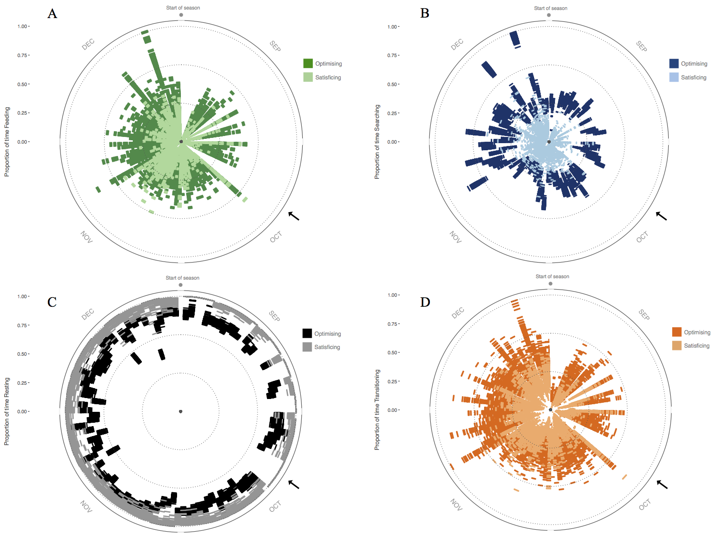
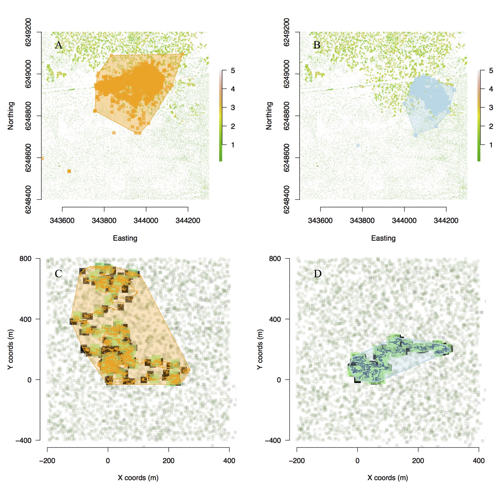
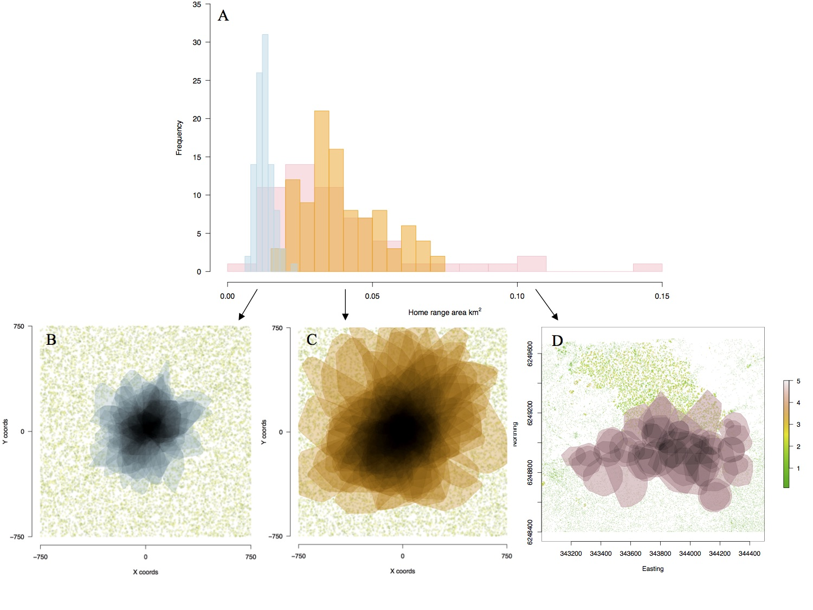
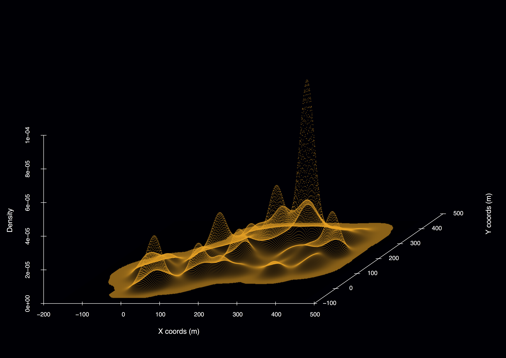
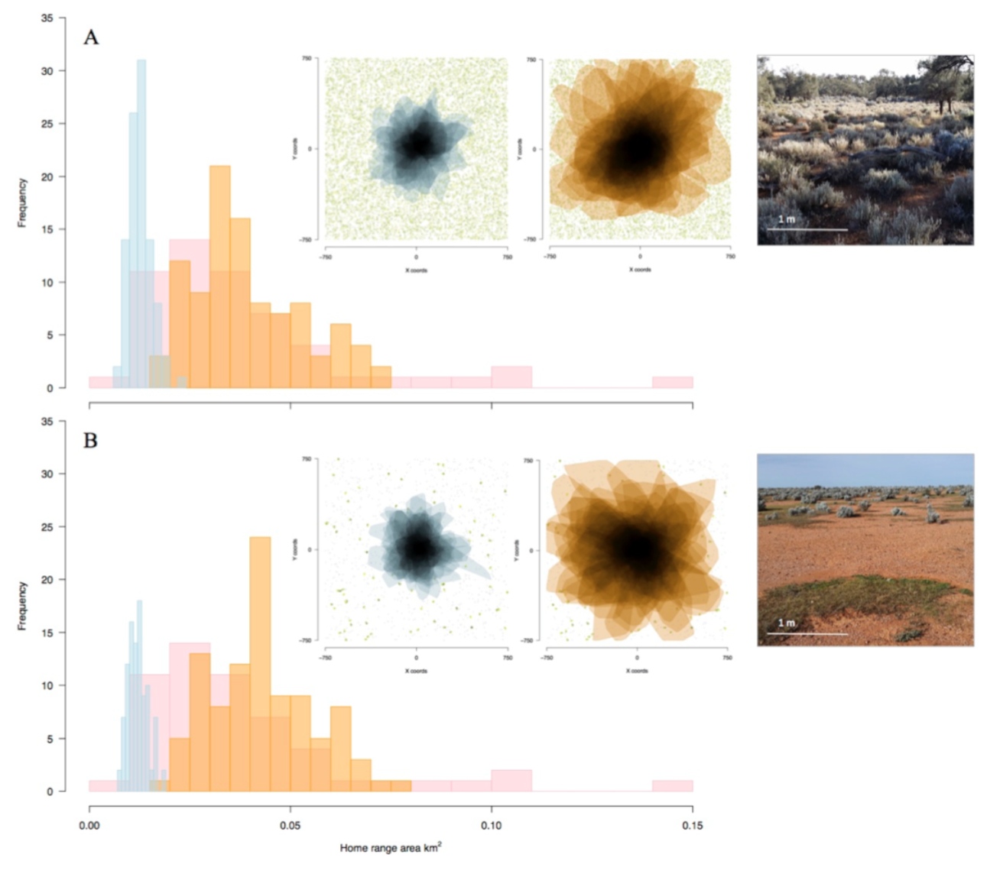

******

	   
	          
	   

## Simulating animal movement and dispersal potential in space and time from individual bioenergetics and habitat data          

### Location

Emory University Atlanta, USA

### People

**Matt Malishev, Emory University, USA**  
Michael Kearney, University of Melbourne, Australia  
C. Michael Bull, Flinders University, Australia    
  
### Tasks

* Developed a simulation model forecasting animal movement and dispersal potential in space and time using weather, microclimate, LIDAR, and geolocation data.   
* Integrated metabolic theory into an individual-based simulation model.     

### Outcomes

_Research_  

* **Malishev M**, Bull CM & Kearney MR (2018) An individual-based model of ectotherm movement integrating metabolic and microclimatic constraints. Methods in Ecology and Evolution. 9(3): 472–489, [doi:https://doi.org/10.1111/2041-210X.12909](https://besjournals.onlinelibrary.wiley.com/doi/abs/10.1111/2041-210X.12909).        

* Kearney MR, Munns SL, Moore D, **Malishev M** & Bull CM (2018) Field tests of a general ectotherm niche model show how water can limit lizard activity and distribution. Ecological Monographs. 88(4): 672–693, [https://doi.org/10.1002/ecm.1326](https://esajournals.onlinelibrary.wiley.com/doi/abs/10.1002/ecm.1326).       

_Media_  

[British Ecological Society 2018 Robert May Prize shortlisted article](https://besjournals.onlinelibrary.wiley.com/doi/toc/10.1111/(ISSN)2041-210x.ECRAward2018).    

[Where do Animals Spend Their Time and Energy? Theory, Simulations and GPS Trackers Can Help Us Find Out](https://methodsblog.com/2019/05/22/movement-metabolism-microclimate/), Methods in Ecology and Evolution blog, May 22, 2019.  

### Example outputs  

  
###### Figure 1. Activity budget for all optimising and satisficing animals throughout the breeding season showing proportion of time spent (A) feeding, (B) searching, and (C) resting, as well as (D) proportion of number of transitions between activity states. Radius = time spent in activity state; circumference = days throughout the breeding season. Black arrows indicate a 5-day period where environmental conditions were not conducive to activity, so animals spent this time resting in shade.    
   

###### Figure 2. Movement path and home ranges of real versus simulated sleepy lizards. (A) Individual #11885, a real sleepy lizard showing active movement and (B) individual #11533, a real sleepy lizard showing passive movement, throughout the breeding season. (C) A random simulated optimising individual representing the maximum potential movement and (D) a random simulated satisficing individual representing the minimum movement necessary throughout the breeding season based on its physiological limits. (C–D) green = food patches, black = shade patches, and polygons represent home ranges. Patch size in simulations represents time elapsed on patch.  
   

###### Figure 3. (A) Distributions of home range area (km2) of real (pink) and seeded simulated optimising (orange) and satisficing (blue) movement strategies under dense resource distribution (food and shade). Home range polygons in space showing overlap of seeded simulated (B) satisficing and (C) optimising individuals and (D) real individuals. Home ranges in (D) appear more scattered due to different starting locations of real animals, whereas (B) and (C) have seeded starting locations in the centre of the landscape. The vegetation layer in (D) is generated from LIDAR data of the habitat site, showing the thermal mosaic of the landscape.
   

###### Figure 4. Simulated satisficing individual in a habitat of sparse resources and shade distributed in space. Density peaks represent time spent in each patch.  
   

###### Figure 5. Home range area (km2) of an adult sleepy lizard for different months throughout the breeding season. Location is the Bundey Bore field station in the mid-north of South Australia (139°21’E, 33°55’S).    
   

###### Figure 6. Distributions of home range area (km2) of real animals (pink) and simulated optimising (orange) and satisficing (blue) movement strategies under (A) dense and (B) sparse resource distribution (food and shade). Insets (L–R): Home range polygons in space showing overlap of simulated satisficing (blue) and optimising (orange) movement strategies, and examples of (upper) dense and (lower) sparse resource distributions in the study site.   
  

**GPS data collection**   

All data were collected at the sleepy lizard habitat study site (139°21’E, 33°55’S) at the Bundey Bore field station in the mid-north of South Australia during the breeding season (September to December, 2009). Animal data are for the adult sleepy lizard (n = 60). Individual animals were tagged with GPS units, step counters (‘waddleometers’), and skin surface temperature probes at the beginning of the breeding season and tracked throughout the season using radio telemetry. Animals were captured and GPS data downloaded every two weeks throughout the breeding season for each individual, with batteries for the units replaced when needed. GPS units reported locations every 10 minutes, waddleometers recorded step counts every 2 minutes, and temperature probes recorded skin surface temperature every 2 minutes. The simulation model uses a 2-minute time step to correspond to the frequency of observed data.     

**NicheMapR modelling engine**  

The NicheMapR microclimate model calculates hourly estimates of solar and infrared radiation, air temperature at 1 m and 1 cm above ground level, wind velocity, relative humidity, and soil temperature at different intervals, e.g. 0 cm, 10 cm, 20 cm, 50 cm, 100 cm, and 200 cm. The model uses minimum and maximum daily air temperature, wind speed, relative humidity, soil properties (conductivity, specific heat, density, solar reflectivity, emissivity), as well as the roughness height, slope, and aspect. Climatic data are gathered from a global data set of monthly mean daily minimum and maximum air temperatures and monthly mean daily humidity and wind speeds. Soil surface temperatures are computed using heat balance equations, accounting for heat exchange via radiation, convection, conduction, and evaporation.
For simulation time steps, the microclimate model verifies the microclimate conditions for the current simulation hour of the day, e.g. noon or 18:00, and location in space, i.e. the study site for the observed animal data, and updates patches in the simulation landscape (either sun or shade) with these microenvironment conditions. As the simulated animal moves in or out of these patches at each time step, the animal updates its current T_b, including rates of change in T_b per 2-minute time step.
The onelump_varenv.R and DEB.R functions update the individual internal thermal and metabolic states, respectively. See below for both model functions.

### Links  

[Project Page on Github.](https://github.com/darwinanddavis/Sleepy_IBM)      

[Supplementary Material for Malishev M, Bull, CM, and Kearney MR (2018) MEE, 9(3): 472–489](https://github.com/darwinanddavis/MalishevBullKearney).    

Kearney, M. R., and W. P. Porter. 2017. NicheMapR - an R package for biophysical modelling: the microclimate model. Ecography 40:664–674, [doi.org/10.1111/ecog.02360](https://onlinelibrary.wiley.com/doi/full/10.1111/ecog.02360).         

[NicheMapR](https://mrke.github.io/): Software suite for microclimate and mechanistic niche modelling in the R programming environment.    
   
 

******  

[Back to top](#top)|[Home page](./index.md)
