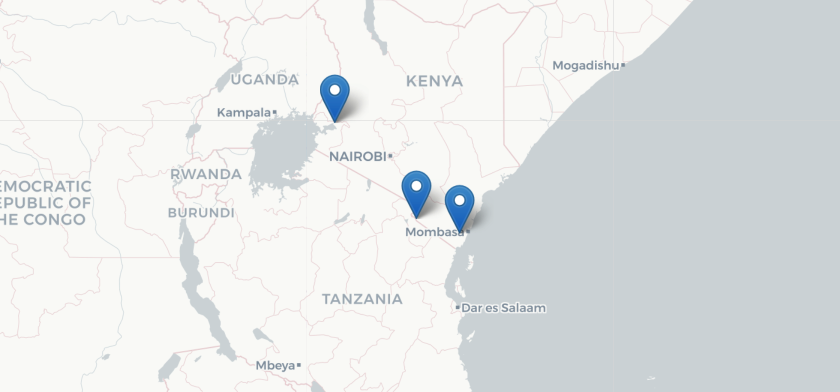

******  
   

## Time series analysis of field temperature data identifies human-induced change to snail host habitats producing human schistosomes  

### Snapshot  

text

### Location  

Emory University Atlanta, USA

### People  

Seul Lee, Emory University, USA       
**Matt Malishev, Emory University, USA**    
Martina Laidemitt, NIH Fogarty International Center, USA  
David Civitello, Emory University, USA      

### Tasks   

* text 
* text       

### Outcomes    

* text    

### Example outputs 

  
###### Figure 1. Site locations for temperature probe data and _Biompharalia_ habitats.  
   

[wavelet1](time_series1.jpg)  
   

[wavelet1](time_series2.jpg)  
   

[wavelet1](time_series3.jpg)  
 
   
   

******    

[Back to top](#top) | [Home page](index)
